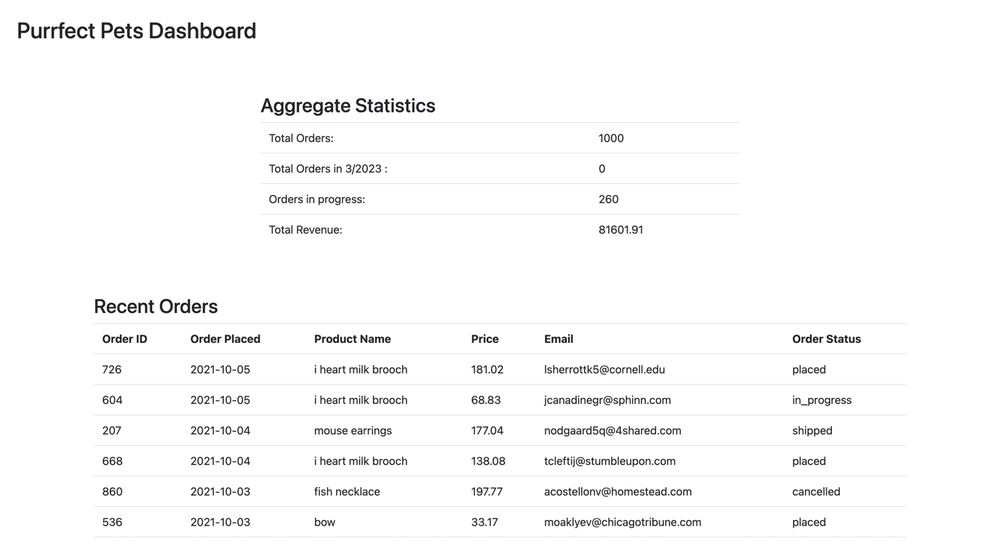

### Setup Instructions
```shell
docker build -t purrfect_creations .
docker run -e AIRTABLE_API_KEY=<your key> -p 5000:5000 purrfect_creations
```

And then go to `localhost:5000/dashboard`

There are two other endpoints, `localhost:5000/statistics` which shows the 
results of the calculations without any view logic, and `localhost:5000/api/health`
which can be used to determine if the Flask server is able to serve web traffic.
